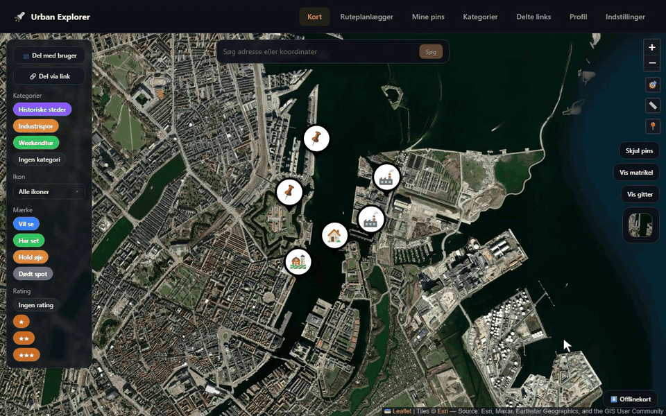
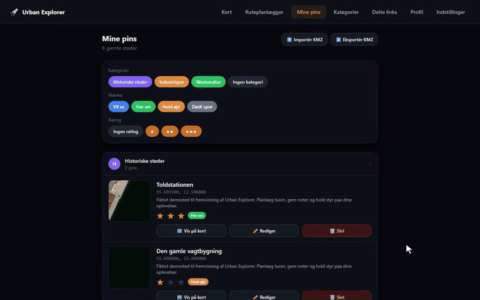
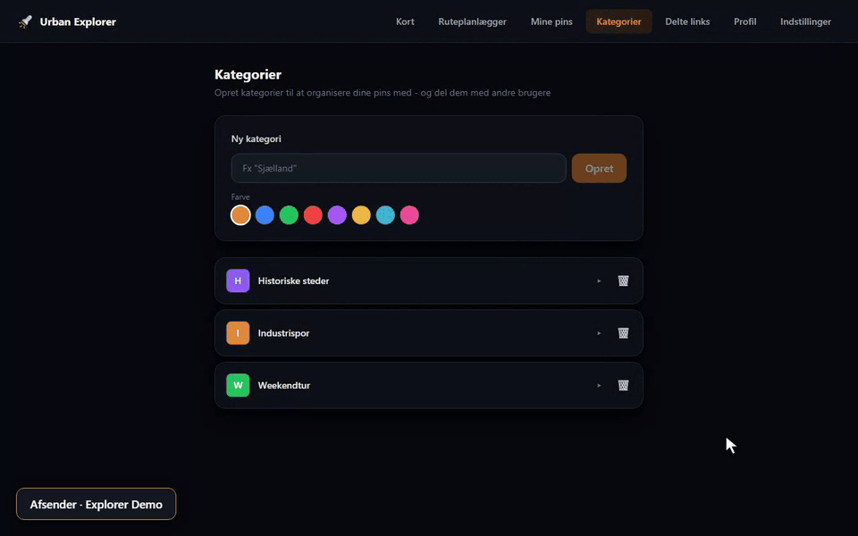

# Urban Explorer

Find, markér og organisér steder på et satellitkort. Gem noter, billeder og videoer, planlæg ture, og del udvalgte pins eller kategorier med andre.

Urban Explorer kan køre selvstændigt med Docker Compose eller installeres gennem FjordHub. Appen er lavet til både computer og mobil.

## Se Urban Explorer i brug

### Udforsk kortet

Filtrér dine steder efter kategori, og åbn en pin for at se noter, rating og status.



### Hold styr på dine pins

Find stederne i **Mine pins**, redigér deres status, og gem ændringerne.



### Del med andre

Del en kategori med en anden bruger, og vælg **Vis** for at give læseadgang. Følg derefter modtageren, som finder kategorien under **Delt med dig**, ser de delte pins og åbner deres detaljer.



*Optaget i en separat demoinstallation med fiktive steder og demodata.*

## Funktioner

### Kort og udforskning

- Satellitkort, vejnavne og outdoor-kort med Esri eller MapTiler.
- Danske luftfotos og skråfotos via Dataforsyningen, når en token er konfigureret.
- Matrikelkort med oplysninger om den valgte matrikel.
- Søgning efter adresser eller koordinater og visning af din aktuelle position.
- Pins samlet i klynger ved større afstande og filtre efter kategori, ikon, status og rating.
- Søgegitter på 1 × 1 km, så du kan holde styr på gennemgåede områder.
- Afstandsmåling og mulighed for at tegne og gemme ruter til en pin.

### Pins, kategorier og medier

- Gem navn, beskrivelse, koordinater og en rating på op til tre stjerner.
- Markér steder som **Vil se**, **Har set**, **Hold øje** eller **Dødt spot**.
- Vælg mellem appens pinikoner, og organisér en pin i flere kategorier med egne farver.
- Brug **Mine pins** til at filtrere, redigere og finde tilbage til steder på kortet.
- Tilføj billeder og videoer, og åbn dem i en større visning.
- Åbn en pins placering i Google Maps eller Skråfoto.

### Ruteplanlægning

- Vælg pins til en køretur, og vælg start- og slutpunkt.
- Beregn ruten med Valhalla, som kan optimere rækkefølgen af mellemstop.
- Se afstand, forventet køretid og de enkelte strækninger.
- Gem ruter og åbn dem igen under **Gemte ruter**.
- Start navigation til stoppene via Google Maps.

Den medfølgende Valhalla-container bygger vejdata for **Danmark**. API'et accepterer højst 50 rutepunkter pr. beregning. Første opstart kræver download og opbygning af vejdata, før ruteplanlægningen er klar.

### Deling og samarbejde

- Del kategorier, enkelte pins eller dine ukategoriserede pins med andre brugere.
- Vælg, om modtageren kun må se indholdet eller også må redigere det.
- Opret delingslinks til udvalgte pins, så de kan ses uden en brugerkonto.
- Administrér og fjern delingslinks under **Delte links**.
- Gem en kopi af en pin, som en anden bruger har delt med dig.

### Import og eksport

- Importér punktmarkeringer fra **KML** og **KMZ**, også fra flere filer ad gangen.
- Gennemgå importerede kandidater, før du gemmer dem som pins.
- Eksportér dine pins som KMZ med beskrivelser, pinikoner og tilknyttede mediefiler.

Importen accepterer filer på op til 25 MB og højst 2.000 punkter ad gangen. Den importerer punktmarkeringer; det er ikke en fuld gendannelse af en databasebackup.

### Offlinekort og mobil

- Download et valgt kortområde med GeoDanmark-luftfotos, pins og relevante gemte ruter.
- Vælg mellem fire detaljeniveauer, og følg downloadens størrelse og fremdrift.
- Åbn hentede områder fra den samme browser, også når forbindelsen forsvinder.
- Brug mobilnavigationen eller installér appen som en PWA, hvor browseren understøtter det.

Download af offlinekort kræver en **Dataforsyningen-token** og internetforbindelse. Pakkerne gemmes lokalt i browserens lager, ikke i serverens database. Hent dem på den enhed, du skal bruge, og behold browserdataene. Offlinekort er til visning af hentet indhold; beregning af nye køreruter kræver forbindelse til serveren.

## Installation med FjordHub

Installér **Urban Explorer** fra FjordHubs appkatalog. Manifestet [fjordhub.json](fjordhub.json) beskriver webport, kortnøgler, upload-mappe og de secrets, som FjordHub genererer.

Integrationen understøtter login fra FjordHub, synkronisering af brugere og adgangskodenulstilling gennem hubben. Kortudbyder og kortnøgler kan stadig administreres i Urban Explorers **Indstillinger**.

## Selvstændig installation med Docker Compose

Du skal have Git, Docker og Docker Compose tilgængeligt. På Windows kan Docker Desktop bruges.

### 1. Hent projektet

```sh
git clone https://github.com/qlerup/urban-explorer.git
cd urban-explorer
```

### 2. Opret secrets til en ny installation

Windows / PowerShell:

```powershell
.\scripts\generate-secrets.ps1
```

Linux / macOS med Bash og OpenSSL:

```sh
bash scripts/generate-secrets.sh
```

Scriptet skriver en `.env` med `DB_PASSWORD`, `JWT_SECRET` og `ENCRYPTION_KEY`. **Kør det kun ved førstegangsopsætning:** det overskriver filen og udskifter nøglerne. En eksisterende installations krypteringsnøgle skal bevares, så gemte oplysninger fortsat kan læses.

### 3. Vælg port og lagerplads

Behold de genererede secrets, og tilpas eventuelt disse værdier i `.env`:

```dotenv
APP_PORT=3001
TZ=Europe/Copenhagen
UPLOADS_HOST_DIR=./data/uploads
MAPTILER_KEY=
DATAFORSYNINGEN_TOKEN=
```

**Esri er standard**, så du kan starte uden en MapTiler-nøgle. Vælg senere MapTiler og indsæt din nøgle under **Indstillinger**, hvis du ønsker den udbyder. Dataforsyningen-token er valgfri og bruges til de danske korttjenester og offlinekort.

`UPLOADS_HOST_DIR` kan pege på lokal disk eller et allerede monteret NAS/NFS-share. Mappen skal være skrivbar for containerens bruger, UID/GID `1001`. Hvis variablen udelades, bruger Compose et Docker-volume til medierne.

### 4. Byg og start

```sh
docker compose up -d --build
```

Åbn [http://localhost:3001](http://localhost:3001). Har du valgt en anden `APP_PORT`, skal du bruge den i adressen.

Første besøg åbner opsætningsguiden, hvor du opretter administratoren. Opsætningssiden lukkes efter den første konto. Administratoren kan derefter oprette flere brugere under **Indstillinger**.

Ved adgang fra andre enheder skal appen sættes bag en **HTTPS-reverse proxy**: produktionslogin bruger Secure-cookies, og PWA/offlinefunktioner kræver en sikker browserkontekst. `localhost` kan bruges til lokal afprøvning.

Følg eventuelt opstarten med:

```sh
docker compose ps
docker compose logs -f app valhalla
```

Valhalla bygger sit danske vejnet ved første opstart. Kort og pins kan bruges, mens rutedata bliver klargjort.

## Indstillinger og brugere

Administratorer kan vælge kortudbyder, gemme MapTiler- og Dataforsyningen-nøgler, konfigurere SMTP og administrere brugere.

**Glemt adgangskode** kan aktiveres eller deaktiveres i appen. Selvstændige installationer sender nulstillingskoder med den konfigurerede SMTP-server. FjordHub-installationer bruger hubbens centrale opsætning til nulstilling af hub-kontoen.

## Konfiguration

Se også [.env.example](.env.example) og [docker-compose.yml](docker-compose.yml).

| Variabel | Formål / standard |
| --- | --- |
| `DB_PASSWORD` | Databaseadgangskode. Genereres ved installation. |
| `JWT_SECRET` | Nøgle til login-sessioner. Genereres ved installation. |
| `ENCRYPTION_KEY` | Nøgle til krypterede oplysninger. Skal bevares ved opdatering og gendannelse. |
| `APP_PORT` | Port på Docker-hosten. Standard: `3001`. |
| `TZ` | Tidszone. Standard: `Europe/Copenhagen`. |
| `UPLOADS_HOST_DIR` | Mappe til billeder og videoer. Uden værdi bruges `uploads_data`. |
| `MAPTILER_KEY` | Valgfri nøgle til MapTiler; kan også gemmes i appens indstillinger. |
| `DATAFORSYNINGEN_TOKEN` | Valgfri token til danske korttjenester; kan også gemmes i indstillingerne. |
| `FJORDHUB_URL` | FjordHubs adresse ved hub-integration. |
| `FJORDHUB_APP_ID` | App-id ved hub-integration. Standard: `urban-explorer`. |
| `FJORDHUB_API_KEY` | Intern integrationsnøgle, som bruges sammen med FjordHub. |

Compose sætter desuden `DATABASE_URL` til den interne PostgreSQL-service og `VALHALLA_URL` til `http://valhalla:8002`. Ved en anden driftsopsætning skal disse adresser tilpasses i containerens miljø.

Kortnøgler og mailopsætning, der gemmes via appen, ligger i databasen; konfiguration findes derfor ikke kun i `.env`.

## Data, opdatering og backup

| Lager | Indhold |
| --- | --- |
| `postgres_data` | Brugere, pins, kategorier, delinger, ruter og indstillinger. |
| `UPLOADS_HOST_DIR` eller `uploads_data` | Uploadede billeder og videoer. |
| `valhalla_data` | Downloadede og byggede rutedata, som genbruges ved genstart. |
| Browserens lokale lager | Downloadede offlineområder på den enkelte enhed. |

Tag backup af **PostgreSQL, mediefiler og `.env`**, herunder den oprindelige `ENCRYPTION_KEY`. En KMZ-eksport erstatter ikke en fuld backup af brugere, delinger og indstillinger.

Opdatér en selvstændig installation fra projektmappen:

```sh
git pull --ff-only
docker compose up -d --build
```

Appen sikrer databaseskemaet ved opstart. Behold eksisterende volumes og secrets under opdateringer. FjordHub-installationer kan opdateres gennem hubben.

## Teknologi

- **App:** Next.js 15, React 19 og TypeScript.
- **Kort:** Leaflet til hovedkortet og OpenLayers til skråfotovisningen.
- **Database:** PostgreSQL 16 med PostGIS.
- **Ruter:** Valhalla i en separat container med danske vejdata.
- **Medier:** JPG/PNG og videoformaterne MP4, M4V, MOV, WebM, MKV, AVI og 3GP. Billeder optimeres til WebP med højst 2560 pixels på hver led. Videoafspilning afhænger af browserens understøttelse af format og codec.
- **Uploads:** Filindhold valideres, og større uploads sendes i mindre dele. Mediefiler udleveres via API-ruter med kontrol af adgang til den pågældende pin eller delingslink.
- **Login:** Argon2id-passwordhashes, signerede JWT-sessioner i HttpOnly-cookies og midlertidig låsning efter gentagne fejlforsøg. Navne, emails og gemte credentials krypteres med AES-256-GCM.
- **Offline:** Service worker, Cache Storage og IndexedDB.

## Projektstruktur

```text
urban-explorer/
  docker-compose.yml       # App, PostGIS og Valhalla
  fjordhub.json            # Installation gennem FjordHub
  db/                      # Oprindeligt skema og migrationsfiler
  valhalla/                # Ruteserverens image og opsætning
  scripts/                 # Hjælpescripts
  docs/demo/               # GIF-demoer til README
  app/
    public/                # Ikoner, PWA-manifest og service worker
    src/app/               # Sider og API-ruter
    src/components/        # Kort, pins, ruter, deling og indstillinger
    src/lib/               # Dataadgang, auth, medier, offline og integrationer
    src/instrumentation.ts # Skema og initialisering ved opstart
    src/middleware.ts      # Sessionskontrol og adgangskodeskift
```
